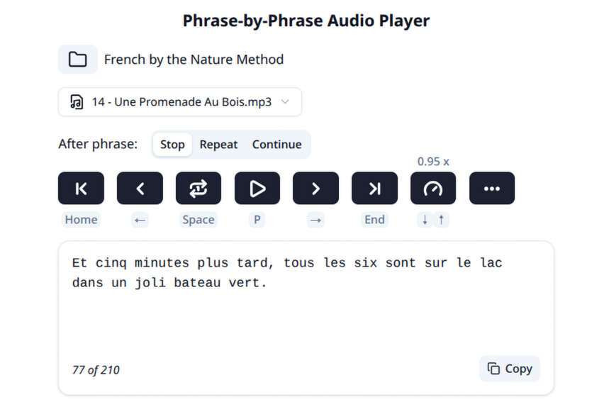

# Phrase-by-Phrase Audio Player

🇬🇧 English | 🇷🇺 [Русский](./README.ru.md)

App itself: <https://mleg.github.io/phrase-player/>

<!-- toc -->

- [Overview](#overview)
- [Features](#features)
- [How To Use](#how-to-use)
- [Where Do I Get Subtitles?](#where-do-i-get-subtitles)
- [Contributing](#contributing)

<!-- tocstop -->

## Overview

This is a simple web app that plays an audio file **phrase by phrase** with repetition (if necessary) using a matching **subtitle** file in SRT format.  
It is intended for **language learners**.

> It's similar to [WorkAudioBook](http://workaudiobook.com/) which I used previously.  
> But WorkAudioBook is an old Windows-only app with a somewhat complex UX. Anyway huge thanks to the author.

Subtitles are not generated by the app — you need to provide them yourself.

> It works **offline**, your files are never uploaded or sent to any server.



## Features

- Phrase repetition
- Navigation through subtitles (phrases)
- Playback speed control
- Designed for quick use with _keyboard_ (though it works well on mobile also)

## How To Use

Place your subtitle files alongside audio files. SRT file should have **the same name** as audio file and should reside **in the same folder**.  
Choose this folder with `Choose media folder` button and the rest should be self-explanatory I hope.

## Where Do I Get Subtitles?

That’s a broad topic.  
I generate them with [whisper.cpp](https://github.com/ggml-org/whisper.cpp).  
whisper.cpp can be used right in the browser without complicated setup:  
[Whisper Web](https://huggingface.co/spaces/Xenova/whisper-web)
and [Minimal whisper.cpp example running fully in the browser](https://ggml.ai/whisper.cpp/)

Videos like movies and series often have subtitles. This app accepts only audio files
but you can extract audio easily with _FFmpeg_:

```sh
ffmpeg -i input.mp4 output.mp3
```

FFmpeg can also convert subtitles between different formats:

```sh
ffmpeg -i input.vtt output.srt
```

## Contributing

Contributions are welcome. However, I’d like to keep this app simple and focused — not a “kitchen sink” solution.
If you want to add features like subtitle editing, consider building a dedicated app instead.
